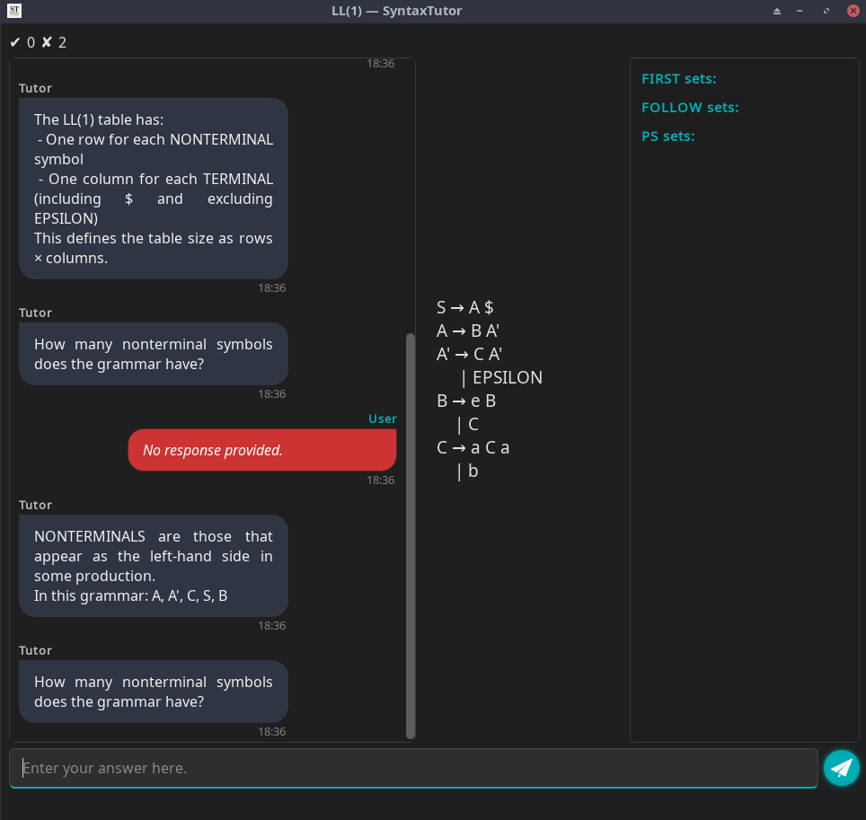
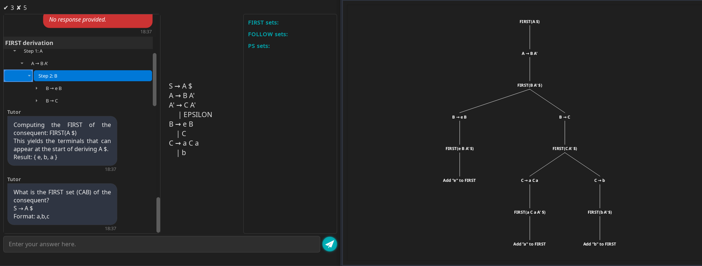
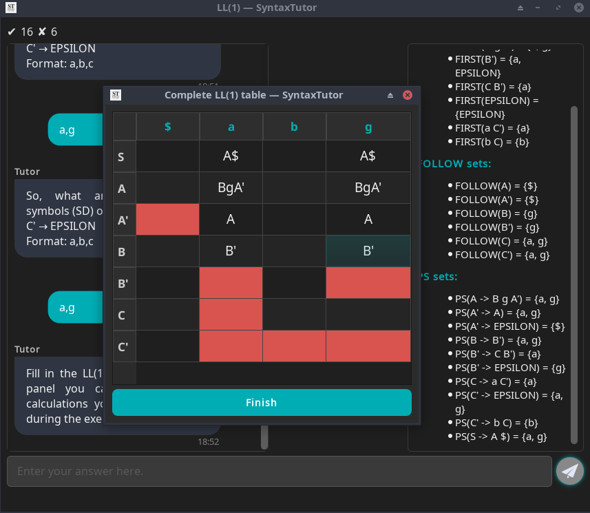
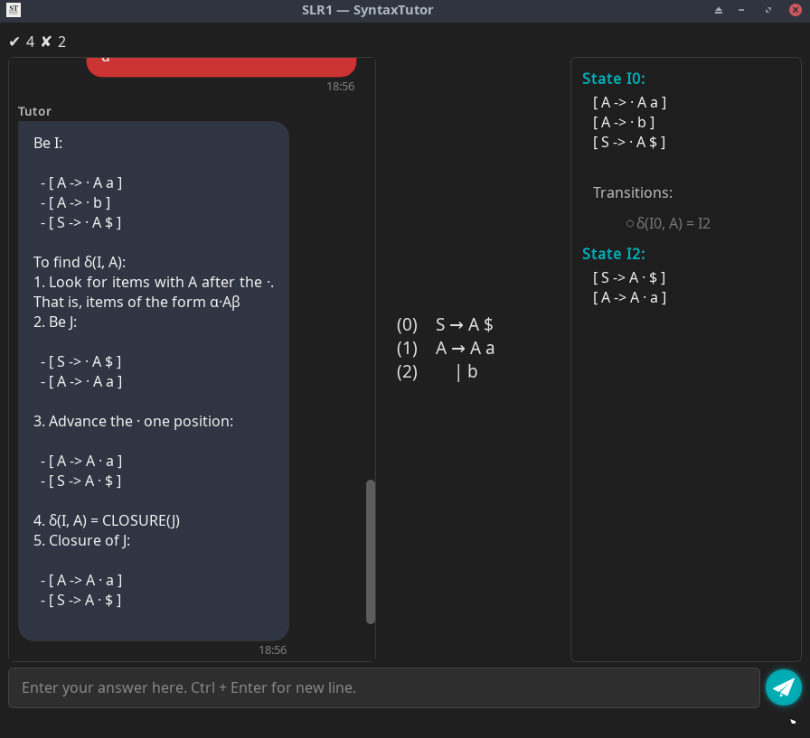
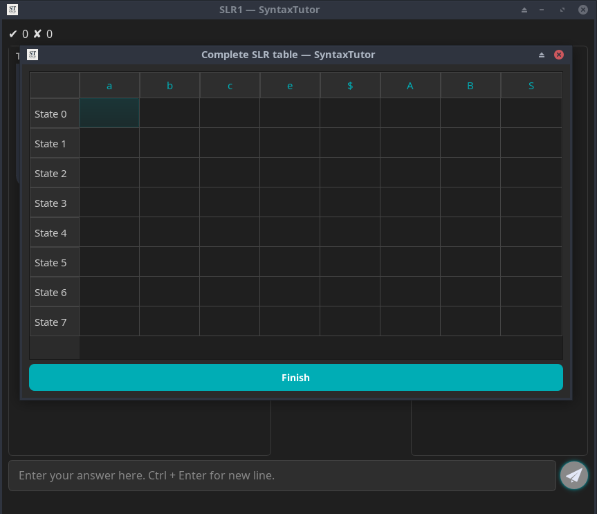

# SyntaxTutor: An interactive Tool for Learning Syntax Analysis

SyntaxTutor is an educational application designed to help compiler students understand LL(1) and SLR(1) parsing algorithms. Through a visual and interactive interface, it guides users step-by-step through the computation of FIRST, FOLLOW, CLOSURE, GOTO, predictive parsing tables, and LR automata, offering real-time pedagogical feedback.

Rather than acting as a mere calculator, SyntaxTutor functions as a learning companion. It explains the reasoning behind each step, highlights common mistakes, and encourages students to engage with the theory behind the algorithms.

---

## 🎓 Academic Context
SyntaxTutor is part of a Final Degree Project (TFG) developed at the University of Málaga (UMA), in the Computer Engineering program.
Its main goal is to offer an educational companion for students learning syntax analysis, going beyond traditional calculators by incorporating guided feedback, visualization, and gamified learning.

---

## 🎯 Key Features
- **Educational Focus**: built to teach, not just compute.
- **Visualization**: derivation trees, intermediate steps, sets, and tables.
- **Exportable Results**: useful for reports or coursework.

---

## 🖼️ Interface Screenshots

### 🏠 Main Menu


Home screen with gamification, levels, and language options.

### 📘 LL(1) Learning Mode



Interactive LL(1) tutor asks questions and provides feedback.



Derivation tree view showing how FIRST sets are built step-by-step.



Completion of the LL(1) predictive table with visual guidance.

### 🧠 SLR(1) Learning Mode


User is asked to identify symbols after the dot in an LR(0) item.



Step-by-step explanation of the GOTO/closure construction.



Interactive SLR(1) table to complete, with states and terminals/non-terminals.

### ✨ Assisted Mode: Guided Table Completion


SyntaxTutor walks the student through each cell in the parsing table with hints and context.

---

## 🛠️ Technologies Used
- **C++**: efficient implementation of parsing algorithms
- **Qt6**: modern, cross-platform graphical user interface.
- **Modular architecture**: clean separation between logic and UI, designed for easy extensibility.

---

## 📦 Downloads
Precompiled builds of SyntaxTutor are available in the Releases tab:
- 🐧 Linux (X11): executable AppImage
- 🪟 Windows: ZIP archive with the .exe
- 🍎 macOS: .app bundles for both Apple Silicon (ARM) and Intel

> [!WARNING]
> The Windows and macOS versions are not digitally signed. Your operating system may display a warning when running the application. You can bypass it manually if you trust the source.

---

## 🛠️ Building from Source
To build SyntaxTutor from source, you just need:
- Qt6 (including `qmake6`)
- A C++20-compliant compiler
```
qmake6
make
````
---

### 📚 Documentation

Full documentation for the source code is available via Doxygen:

* **🌐 Online HTML Documentation**: [https://jose-rzm.github.io/SyntaxTutor/](https://jose-rzm.github.io/SyntaxTutor/)
* **📄 PDF Reference Manual**: [refman.pdf](docs/latex/refman.pdf) (in the `docs/latex/` folder)

The documentation includes:

* Detailed class and function reference
* Graphs of dependencies and inheritance
* Descriptions of parsing algorithms and internal logic

To regenerate it locally, install [Doxygen](https://www.doxygen.nl/) and run:

```bash
doxygen
```

This will update the contents of the `docs/` folder with both HTML and LaTeX output.
