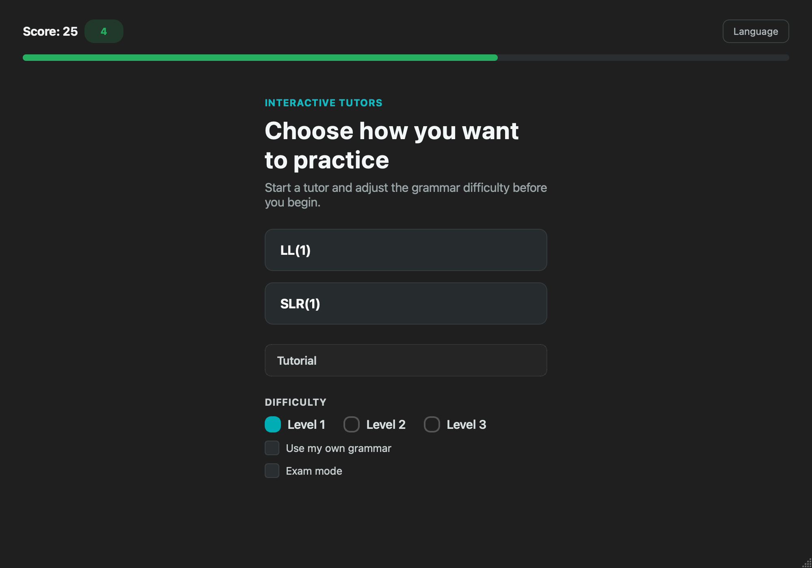
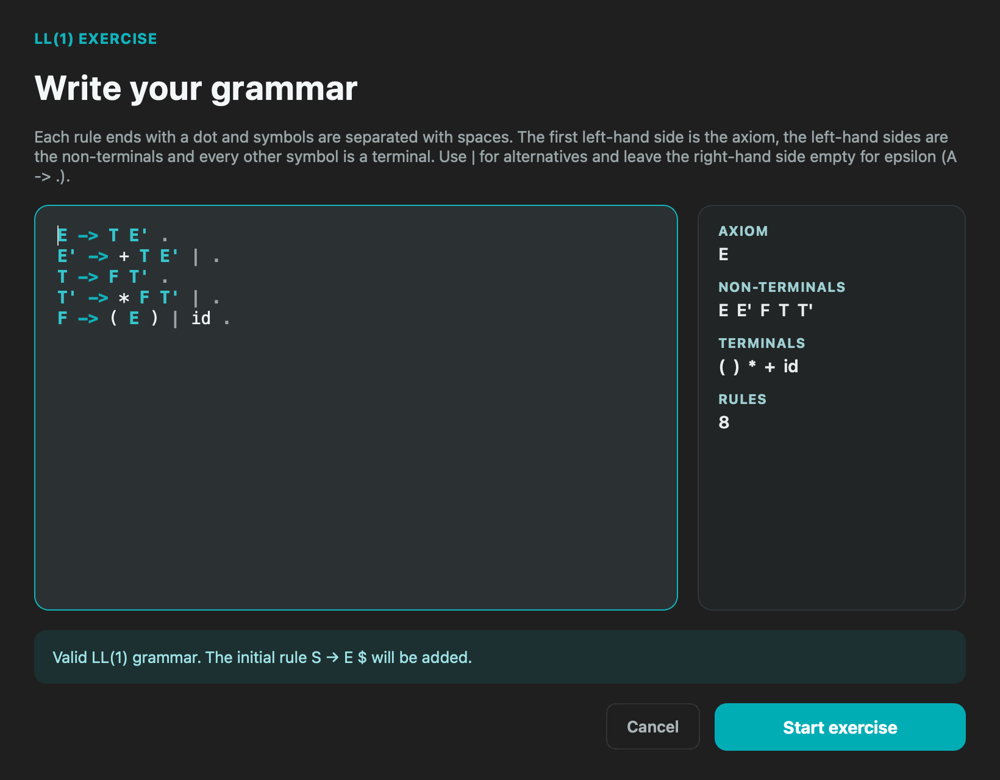
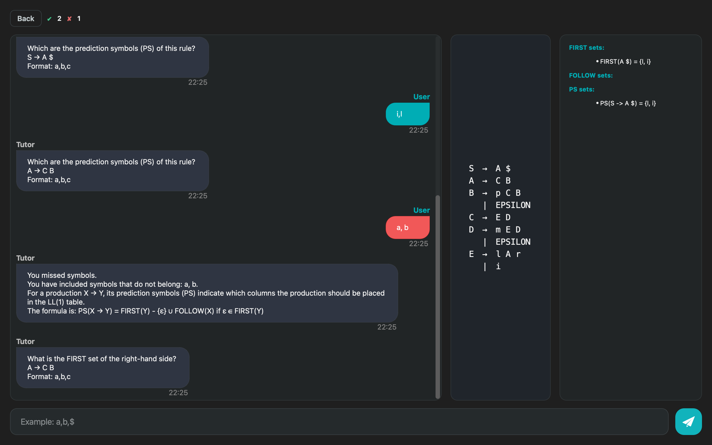
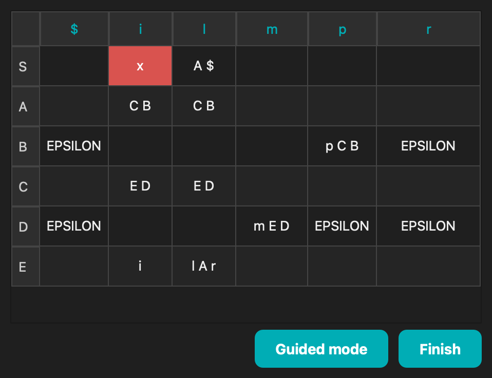
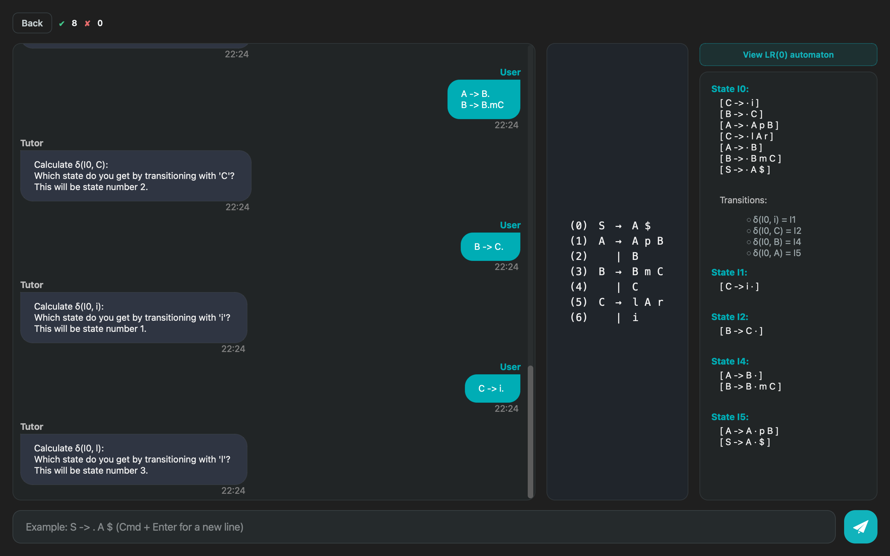
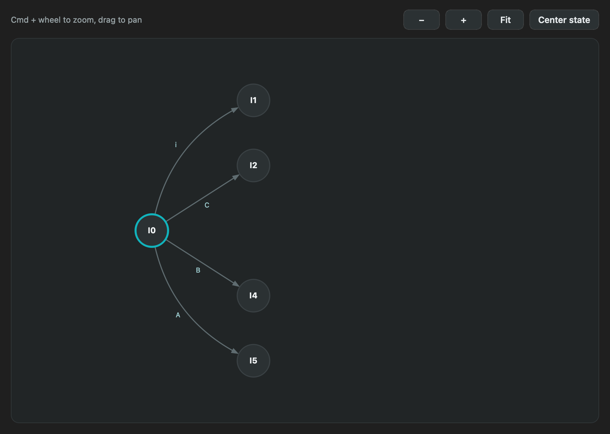
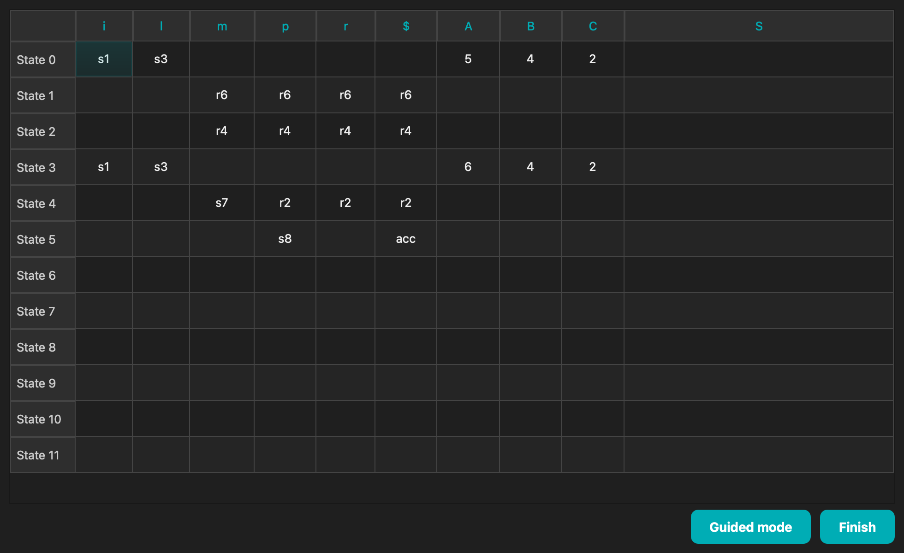
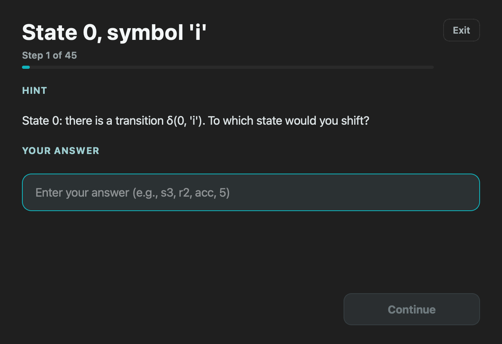
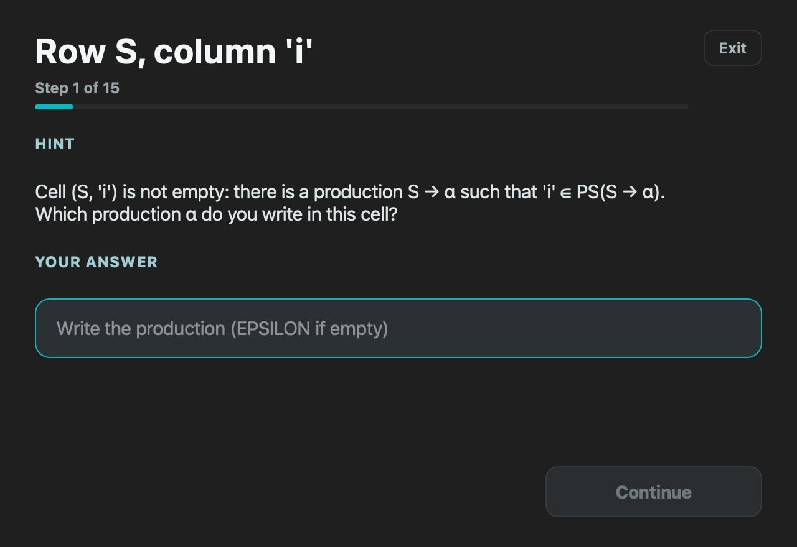
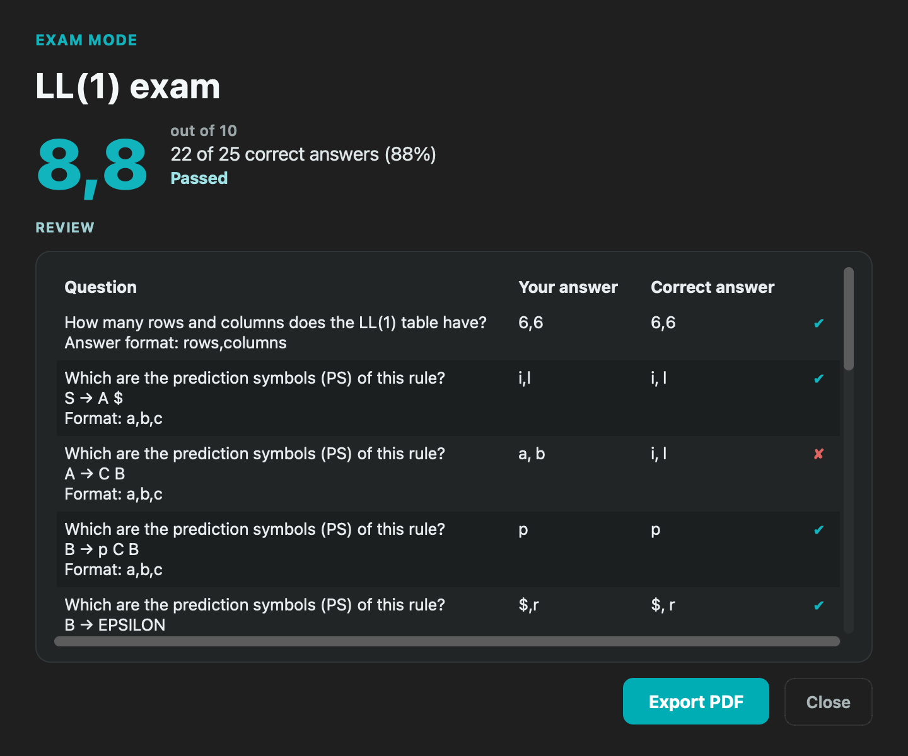

<p align="center">
  <picture>
    <source media="(prefers-color-scheme: dark)" srcset="resources/icon/lockup/syntaxtutor-lockup-light-text.svg">
    <source media="(prefers-color-scheme: light)" srcset="resources/icon/lockup/syntaxtutor-lockup-dark-text.svg">
    
  </picture>
</p>

**An interactive tutor for learning LL(1) and SLR(1) parsing.**

[](https://github.com/jose-rZM/SyntaxTutor/releases/latest)
[](https://github.com/jose-rZM/SyntaxTutor/actions/workflows/tests.yml)
[](LICENSE)


SyntaxTutor helps compiler students understand how LL(1) and SLR(1) parsers are built. The
student works through each algorithm one question at a time: FIRST and FOLLOW sets,
prediction symbols, LR(0) items, closures, transitions and, finally, the parsing table. Every
answer is checked on the spot, and a wrong answer leads to smaller questions that rebuild the
reasoning step by step, so the student learns why a result is what it is.

> [!NOTE]
> **Project status.** SyntaxTutor 2.0 is the final feature release. The project is considered complete, and no
> further development is planned.

## Contents

- [Features](#features)
- [Getting started](#getting-started)
- [How it works](#how-it-works)
- [Screenshots](#screenshots)
- [Documentation](#documentation)
- [Building from source](#building-from-source)
- [Project structure](#project-structure)
- [Background](#background)
- [License](#license)

## Features

- **Step-by-step tutors** for LL(1) and SLR(1), with immediate feedback on every answer.
- **Pedagogical branching**: mistakes open smaller questions instead of revealing the result.
- **Your own grammars**: a grammar editor with live validation, or generated grammars at three
  difficulty levels.
- **Exam mode**: no feedback during the exercise, a 0–10 grade at the end and a
  question-by-question review.
- **LR(0) automaton** drawn progressively as the student computes states and transitions.
- **Guided table modes** that walk through the LL(1) and SLR(1) tables one cell at a time.
- **PDF export** of the conversation, sets, automaton states, parsing tables and exam reports.
- **Quick references** for the theory of both algorithms.
- **Spanish and English** interface, adjustable text size and gamified progress.

## Getting started

Download the build for your system from the
[latest release](https://github.com/jose-rZM/SyntaxTutor/releases/latest). No installation or
Internet connection is needed.

| System | Download | Requirements |
|---|---|---|
| Windows | `SyntaxTutor-<version>-windows-x64.zip` | Windows 10 or 11, 64-bit |
| macOS | `SyntaxTutor-<version>-macos-arm64.zip` | Apple Silicon (M1 or later) |
| Linux | `SyntaxTutor-<version>-x86_64.AppImage` | Ubuntu 22.04, Debian 12 or newer |

- **Windows**: unzip and run `SyntaxTutor.exe`.
- **macOS**: unzip, move `SyntaxTutor.app` to *Applications* and open it.
- **Linux**: `chmod +x SyntaxTutor-<version>-x86_64.AppImage` and run it. It uses X11, or
  XWayland on Wayland desktops; start it with `QT_QPA_PLATFORM=wayland` to run natively on
  Wayland.

> [!WARNING]
> The Windows and macOS builds are not digitally signed, so the system may warn you the first
> time you open them. The [user manual](#documentation) explains how to open them anyway. Only
> do so with files downloaded from this repository.

Once the application is open, the **Tutorial** button on the home screen gives a short tour of
the interface and the first exercises.

## How it works

**LL(1).** The tutor asks for the size of the predictive table and then, rule by rule, for the
prediction symbols. A wrong answer is broken down into the FIRST set of the right-hand side and
the FOLLOW set of the left-hand side before the question is asked again. The exercise ends with
the LL(1) table, where wrong cells are highlighted and a guided mode is available.

**SLR(1).** The tutor starts from the closure of the initial item and builds the LR(0)
collection state by state: number of items, symbols after the dot and every transition
δ(I, X). It then covers the table dimensions, states with complete items, LR(0) conflicts
resolved with FOLLOW sets and reduce-only states, and ends with the SLR(1) parsing table.

## Screenshots

| | |
|---|---|
|  |  |
| **Home.** Choose a tutor, the difficulty, your own grammar or exam mode. | **Grammar editor.** Live validation; only LL(1) or SLR(1) grammars are accepted. |
|  |  |
| **LL(1) tutor.** A wrong answer leads to questions about FIRST and FOLLOW. | **LL(1) table.** Wrong cells are highlighted after each submission. |
|  |  |
| **SLR(1) tutor.** Building the LR(0) collection, transition by transition. | **LR(0) automaton.** It grows as each state is computed. |
|  |  |
| **SLR(1) table.** `sN`, `rN`, `acc` and goto entries. | **Guided mode.** One cell at a time, with a hint for each. |
|  |  |
| **LL(1) guided mode.** The same help for the predictive table. | **Exam report.** The grade and a review of every answer, exportable to PDF. |

## Documentation

- **User manual**: [English](manual/SyntaxTutor-Manual-EN.pdf) ·
  [Español](manual/SyntaxTutor-Manual-ES.pdf)
- **Developer documentation** (Doxygen): [online](https://jose-rzm.github.io/SyntaxTutor/) ·
  [PDF](manual/SyntaxTutor-Developer-Manual.pdf)
- **Changes between versions**: [CHANGELOG](CHANGELOG.md)

The developer documentation covers every class and function, with dependency and inheritance
graphs. To regenerate it, install [Doxygen](https://www.doxygen.nl/) and Graphviz and run
`doxygen` from the repository root; the output goes to `docs/`.

## Building from source

Requirements:

- Qt 6, including `qmake6` and the Qt SVG module
- A C++20 compiler: GCC 11 or newer, a recent Clang, or MSVC 2022
- [GoogleTest](https://github.com/google/googletest), only for the backend tests

With GNU make, the repository's `GNUmakefile` builds out of tree:

```bash
make app     # the application, in build/app
make check   # backend and GUI tests
```

`make check-core` and `make check-ui` run each suite on its own; the same tests run in CI on
every push and pull request. To use qmake directly, pass `-f Makefile`, because GNU make would
otherwise pick up the `GNUmakefile`:

```bash
qmake6
make -f Makefile
```

## Project structure

| Path | Contents |
|---|---|
| `src/backend/` | Grammar model and parsing engine: FIRST/FOLLOW, LL(1) table, LR(0) items and the SLR(1) table, in plain C++20 with no Qt dependency. |
| `src/gui/` | Main window, the LL(1) and SLR(1) tutors with their question flows, table dialogs, guided modes, exam report and PDF export. |
| `src/widgets/` | Reusable widgets and helpers: chat input, grammar view, LR(0) automaton view, tutorial overlay, typography and settings. |
| `src/app/` | Application entry point. |
| `tests/` | GUI tests with fixed grammar fixtures; the backend tests live in `src/backend/tests.cpp`. |
| `resources/` | Icon, logo, fonts and the application style sheet. |
| `translations/` | Spanish and English translations. |
| `manual/`, `docs/` | User and developer manuals, and the generated Doxygen output. |

## Background

SyntaxTutor 1.x was the Final Degree Project "Interactive Tutorial About Syntax Analyzers"
(2025). Version 2 is a later extension and redesign, developed independently of that project:
it adds custom grammars, exam mode, the LR(0) automaton, guided table modes and a new
interface. See the [CHANGELOG](CHANGELOG.md) for the full list.

## License

SyntaxTutor is free software, released under the
[GNU General Public License v3.0](LICENSE). It is built with [Qt 6](https://www.qt.io/), also
available under the GPLv3, and bundles the JetBrains Mono font under the
[SIL Open Font License](resources/fonts/OFL.txt).

Created by [José R.](https://github.com/jose-rZM). If you use SyntaxTutor in a course or build
on it, a mention of the project is appreciated.
