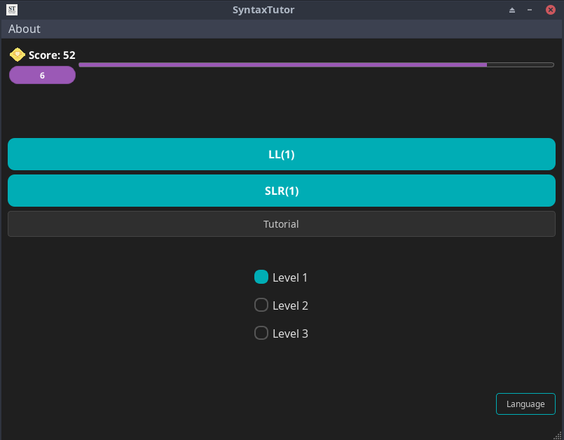
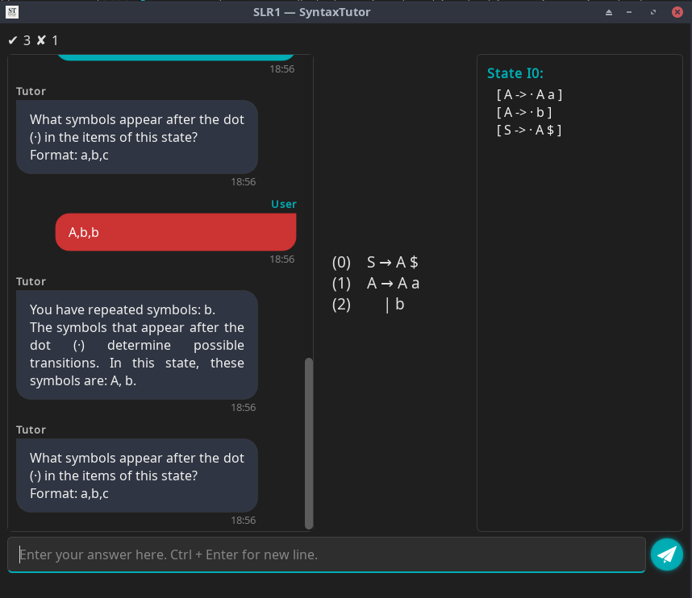

# SyntaxTutor: An interactive Tool for Learning Syntax Analysis

SyntaxTutor is an educational application designed to help compiler students understand LL(1) and SLR(1) parsing algorithms. Through a visual and interactive interface, it guides users step-by-step through the computation of FIRST, FOLLOW, CLOSURE, GOTO, predictive parsing tables, and LR automata, offering real-time pedagogical feedback.

Rather than acting as a mere calculator, SyntaxTutor functions as a learning companion. It explains the reasoning behind each step, highlights common mistakes, and encourages students to engage with the theory behind the algorithms.

---

## 🎯 Key Features
- **Educational Focus**: built to teach, not just compute.
- **Visualization**: derivation trees, intermediate steps, sets, and tables.
- **Exportable Results**: useful for reports or coursework.

---

## 🖼️ Interface Screenshots

### 🏠 Main Menu



Home screen with gamification, levels, and language options.

### 📘 LL(1) Learning Mode


Interactive LL(1) tutor asks questions and provides feedback.


Derivation tree view showing how FIRST sets are built step-by-step.


Completion of the LL(1) predictive table with visual guidance.

### 🧠 SLR(1) Learning Mode



User is asked to identify symbols after the dot in an LR(0) item.


Step-by-step explanation of the GOTO/closure construction.


Interactive SLR(1) table to complete, with states and terminals/non-terminals.

### ✨ Assisted Mode: Guided Table Completion


SyntaxTutor walks the student through each cell in the parsing table with hints and context.

---

## 🛠️ Technologies Used
- **C++**: efficient implementation of parsing algorithms
- **Qt6**: modern, cross-platform graphical user interface.
- **Modular architecture**: clean separation between logic and UI, designed for easy extensibility.

---

## 📦 Downloads
Precompiled builds of SyntaxTutor are available in the Releases tab:
- 🐧 Linux (X11): executable AppImage
- 🪟 Windows: ZIP archive with the .exe
- 🍎 macOS: .app bundles for both Apple Silicon (ARM) and Intel

> [!WARNING]
> The Windows and macOS versions are not digitally signed. Your operating system may display a warning when running the application. You can bypass it manually if you trust the source.

---

## 🛠️ Building from Source
To build SyntaxTutor from source, you just need:
- Qt6 (including `qmake6`)
- A C++20-compliant compiler
```
qmake6
make
````
This will generate the executable in te project directory.
  


